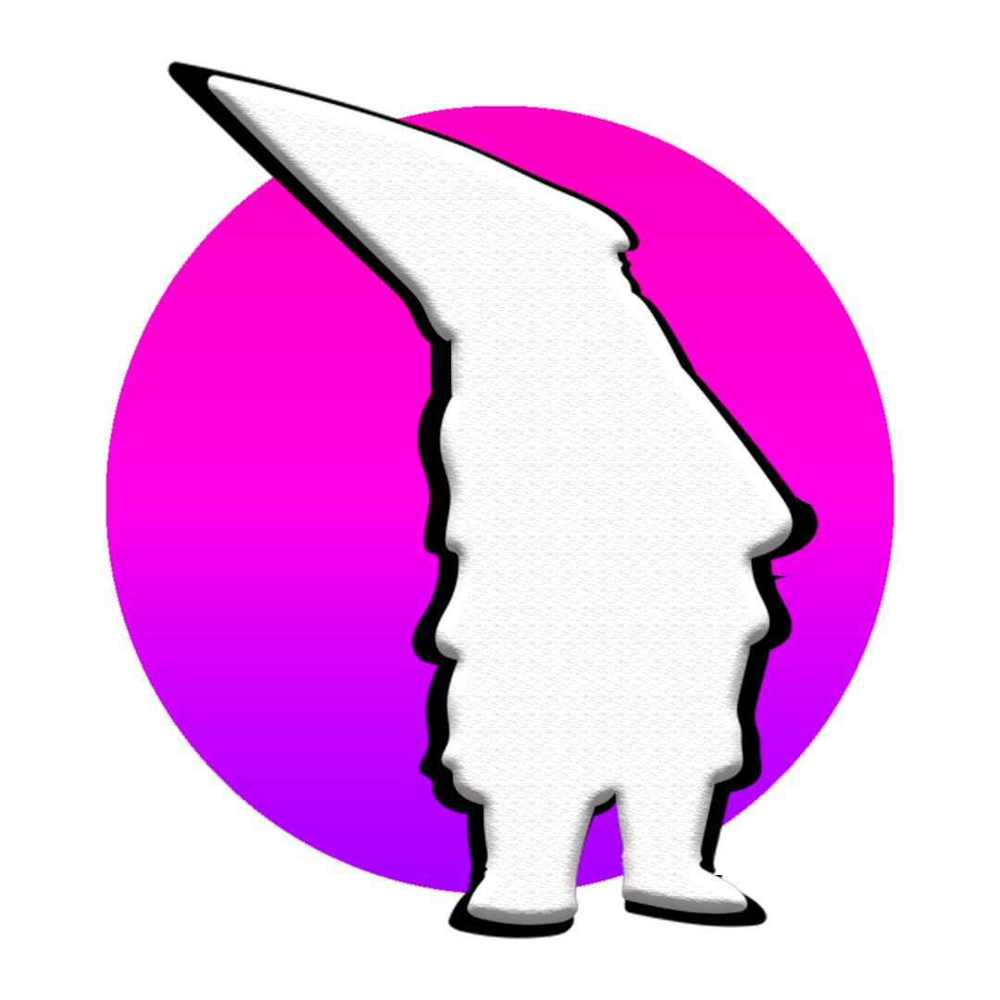

 

  

  <h3 align="center">NomoD</h3>

  

    Mod para Minecraft 1.16.5
     
    <a href="https://github.com/adrilasar/NomoD/releases/latest"><strong>✅ Última versión »</strong></a>
     
     
    <a href="https://github.com/adrilasar/NomoD/issues/new?assignees=adrilasar&labels=bug&template=bug_report.md&title=Bug%3A+%3Cescribe+titulo%3E">Reportar Bug</a>
    ·
    <a href="https://github.com/adrilasar/NomoD/issues/new?assignees=adrilasar%2C+DaniC606&labels=nueva+funcion&template=feature_request.md&title=Petici%C3%B3n%3A+%3Cescribe+titulo%3E">Sugerencias</a>
  

 

## ¿Cómo lo instalo?

1. Descarga [Forge](https://files.minecraftforge.net/net/minecraftforge/forge/index_1.16.5.html). Asegurate que está seleccionada la `1.16.5` y en _**Download Recommended**_ haz click en _**Installer**_. Una vez descargado, sigue los pasos del programa.

3. Descarga la última versión de **NomoD** y **GeckoLib** desde [aquí](https://github.com/adrilasar/NomoD/releases/latest).

4. Coloca los dos _**.jar**_ en la carpeta **`../mods`**
>Suele estar en `../Users/you/AppData/roaming/.minecraft/mods`.
